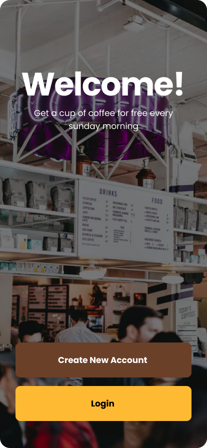

<H1 align="center">Mobile App (REACT NATIVE)</H1>

<div align="center">
  
  <h1> GAYOE APPS</h1>

[](https://www.npmjs.com/package/react-native)
[](https://www.npmjs.com/package/react)
[](https://www.npmjs.com/package/axios)
[](https://www.npmjs.com/package/redux)
[](https://www.npmjs.com/package/react-redux)

<br/>

</div>

Gayoe Apps is a service for order food and beverages. Customer can simply register, login, see products, order, see order history, edit their profile, etc.

## Features

### Public:

- Register
- Login
- Reset Password
- Filter & Sort Products
- Search Products
- Products Detail
- Edit Profile
- Edit Password
- Payment or Checkout

### Admin:

- All users features
- Create Product
- Create Promo
- Update Product
- Update Promo

## How to Run the Application

### 1. Clone the Repository

Clone this repository by running the following command :

```
$ git clone https://github.com/MoIkrom/New-Coffee-Gayoe.git
```

### 2. Install dependency packages

Install dependency packages by run the following code inside project folder:

```
$ npm install
```

OR

```
$ npm i
```

### 3. Set up Project

- Configure .env file

Configure .env file by create file named .env inside project folder and add this line to the file:

<br/>

```
URL_DEPLOY = "YOUR HOST"
channelId = "YOUR CHANNEL ID"
```

- Run Project

Run the app in development mode after server/backend is running. with a command like the following :

```
$ npx react-native run-android
```

## Screenshots

<div style="display:flex" align="center">
<div>


</div>
<div>


</div>
</div>

<br/>

# Related Projects

- Backend Repository [`here`](https://github.com/MoIkrom/Coffee-Gayoe)
